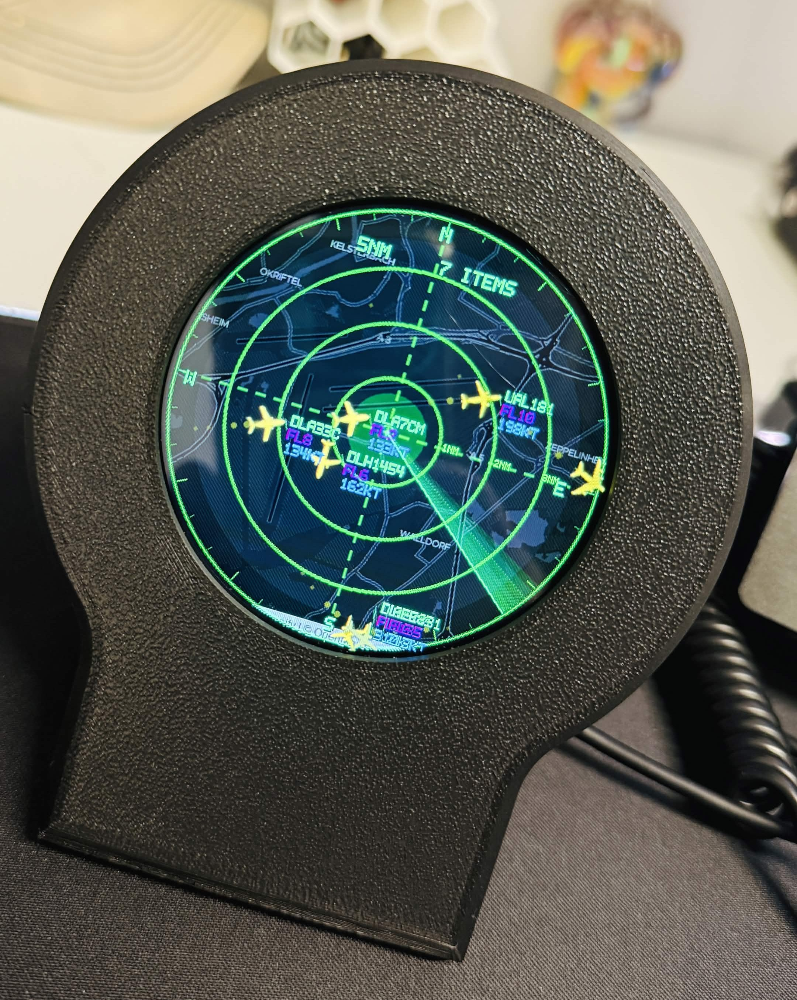

# AeroScope

**NOTE: This project is intended solely as a desktop gadget and must not be used for real-world flight navigation or operational decision-making.**

AeroScope turns an ESP32-S3 round touch display into a small live **aircraft radar desktop gadget**. It shows nearby aircraft over a static map, radar range controls, aircraft trails, airport markers, and a touch details page with flight/aircraft information.

The idea came from looking at existing aircraft-radar display projects: some were very simple and hobby-looking, while others were polished but expensive. This project aims for the middle point: good-looking, useful, and affordable.

<p align="left">
  
</p>


## Hardware

Required:

- [ESP32-S3 LCD Driver Board / 2.8 captive touchscreen](https://he.aliexpress.com/item/1005007354066395.html)

Choose the N8R8 2.8-inch round capacitive touch variant:<br>


Optional:

- 3D printed table mount: [`releases/AeroScopeMount.3mf`](docs/assets/AeroScopeMount.3mf), this mount is based on an [existing model](https://makerworld.com/en/models/2872376-esp32-plane-radar-live-ads-b-on-a-round-display#profileId-3207083) which I modified a bit, but it can probably be improved by contributors.

## Install Firmware

Download the latest firmware binary:

[`releases/firmware.bin`](releases/firmware.bin)

Then flash it with `esptool.py`.

1. Install [Python 3](https://www.python.org/downloads/)
2. Once Python is installed, install esptool:

```bash
python -m pip install esptool
```

3. Connect the radar board to your computer with USB-C.
4. Put the board into boot mode (there are only 2 buttons on the board, one for BOOT and one for RESET):

- Hold **BOOT**.
- Tap **RESET** once.
- Release **BOOT**.

5. Find the serial port:

- Windows: check Device Manager, usually `COM15`, `COM7`, etc.
- macOS: usually `/dev/cu.usbmodem*` or `/dev/cu.usbserial*`.
- Linux: usually `/dev/ttyUSB0` or `/dev/ttyACM0`.

6. Flash the firmware (replace YOUR_PORT with the USB port you are using):

```bash
python -m esptool --chip esp32s3 --port YOUR_PORT --baud 921600 write_flash 0x10000 firmware.bin
```

7. Press **RESET** after flashing.

The screen should boot into AeroScope.

## First Setup

1. Power on the device.
2. Connect your phone or computer to the setup Wi-Fi network:

```text
AeroScope-Setup
```

3. Open the control panel (via any browser):

```text
http://192.168.4.1
```

In the control panel set at minimum the following:

**In Setup tab:**
- Wi-Fi network name and password.
- Your latitude and longitude (you can learn your lat/lon from [here](https://www.latlong.net/my-location-latitude-longitude))
  
**In Preferences tab:**
- Geoapify API key for map images and airport markers (see next section for info).

### Map API Key

AeroScope uses [Geoapify](https://myprojects.geoapify.com/register) for the radar map background and airport markers.

To enable it:

1. Create a Geoapify account using **FREE** plan and create an API key.
3. Open the AeroScope control panel.
4. Go to **Preferences** / **Map** and paste the key into **Geoapify API Key**.

## Use

- Tap the range value at the bottom of the screen to increase range by **5 NM**.
- Long-press the range value at the bottom to decrease range by **5 NM**.
- Tap an aircraft to open its details page.
- Use the dismiss button/text on the details page to return to the radar.

## Notes

- Aircraft and route data depend on public/open data providers, Wi-Fi quality, and local ADS-B coverage.
- Some aircraft may not expose full route, airline, model, or callsign information.
- Map display requires a valid Geoapify API key and internet access.
- Public aviation providers may have rate limits, availability limits, or non-commercial terms. Review each provider's terms before redistribution or public deployment.
- This is a personal/open hobby project, not certified aviation equipment.
- Works with user-entered coordinates worldwide where public aircraft data providers and map data are available. If map data is unavailable, the radar can still show aircraft over the radar display.

## How It Works

- The ESP32-S3 connects to Wi-Fi and polls public aircraft data providers for aircraft near the configured latitude/longitude and range.
- Provider mode can be automatic or manually selected. Current providers include ADSB.lol, ADSB.fi, Airplanes.live, OpenSky, and an optional local Dump1090/Tar1090-style receiver URL.
- Aircraft from multiple providers are merged by ICAO address, filtered by range and ground/airborne setting, then interpolated on screen so movement feels continuous between provider updates.
- The map layer uses Geoapify static map images. Map style and brightness can be changed in the control panel.
- Airport markers are fetched from Geoapify Places and drawn by the firmware over the map.
- Tapping an aircraft opens a details page. Route and airline enrichment is fetched on demand from ADSBDB by callsign, so extra data is requested only when needed.
- The web control panel is served directly by the device and is used for Wi-Fi, location, range, provider, map, and styling settings.

## License

Personal use is allowed. Contributions are welcome.

Commercial use, resale, paid hosting, paid redistribution, or use in a commercial product/service is not allowed without written permission from the project owner.

## Third-Party Licenses

This project uses third-party open-source libraries, tools, and public data sources, including PlatformIO, Arduino ESP32, ArduinoJson, ESP Async WebServer, AsyncTCP, LittleFS, LodePNG, Geoapify, ADSB.lol, ADSB.fi, Airplanes.live, OpenSky, ADSBDB, and optional local Dump1090/Tar1090-style receivers.

Each third-party dependency remains under its own license. Before redistributing firmware, binaries, or modified source, review the dependency manifests and source packages for their full license terms.
